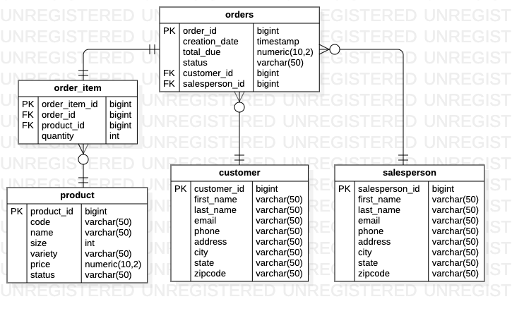

# Introduction
`jdbc` is a Java application that allows users to connect to a PostgreSQL database and create, update, read, and delete data from its tables.

This project is a learning exercise built to understand JDBC (**J**ava **D**ata**b**ase **C**onnectivity), a platform-independent Java API used to connect and execute queries within databases. It implements create, update, read, and delete (CRUD) functionality through design patterns Data Transfer Objects (DTOs) and Data Access Objects (DAOs).

Note: This project was developed following Frank Moley's [Learning JDBC](https://www.lynda.com/Java-tutorials/Learning-JDBC/779748-2.html) course available on learning platform Lynda.

# Entity-Relationship Diagram

The above diagram illustrates the entity-relationship between the different database tables that will be utilized by the `jdbc` application. 

# Layer Separation and Design Patterns

`jdbc` utilizes multilayer architecture. It is designed with two layers in mind: (1) data persistence and (2) service layers. The data persistence layer deals with storing and retrieving data. The service layer holds the business logic required to process and manipulate the data stored and retrieved by the data persistence layer. It does not see how data is stored and retrieved by the data persistence layer, therefore is kept in the dark. Multilayer architecture allows for the business logic to access data without needing to know the underlying data access architecture in place. 

Specific to the data persistence layer: `jdbc` uses the Data Access Object (DAO) to access both [customer](jdbc/src/main/java/ca/jrvs/apps/jdbc/CustomerDAO.java) and [order](jdbc/src/main/java/ca/jrvs/apps/jdbc/OrderDAO.java) data. 

The key difference between the DAO and Repository design patterns is that the DAO deals with data persistence (transfering and storing data) and the Repository deals with storing a collection of objects. 

In practice, DAO design pattern joins within the database, e.g. gets the order, retrieves the customer data, and joins the corresponding customer data to the order table. Acting within the database means that a DAO class can access multiple database tables. The [Order DAO](jdbc/src/main/java/ca/jrvs/apps/jdbc/OrderDAO.java) demonstrates this, as it accesses all five tables present in the application database. 

In contrast, the Repository pattern joins data in the code, e.g. access the database to retrieve information, data is returned to the application, and then joined. Classes following the Repository pattern can only access one database table at a time. While [Customer DAO](jdbc/src/main/java/ca/jrvs/apps/jdbc/CustomerDAO.java) follows the DAO design pattern of working within the database,  [Customer DAO](jdbc/src/main/java/ca/jrvs/apps/jdbc/CustomerDAO.java) also accesses only one database table (Customer). As a result, it can also be interpreted as an example of the Repository pattern.