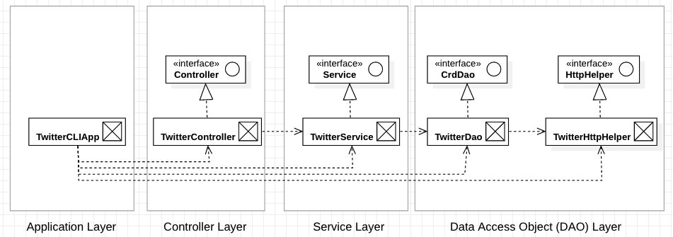

# Introduction
`TwitterCLI` is an command line application that allows its user to post, show, and delete Twitter posts using the Twitter REST API. Based on arguments given to the `TwitterCLI` application, the application sends POST and GET requests to the Twitter REST API. In return, the Twitter REST API processes them, and then sends its reply to these requests. These replies inform `TwitterCLI` if the Tweet was successfully posted and the posted Tweet content, the content of the Tweet to show, and confirmation if the Tweet was successfully deleted and the deleted Tweet content. 

This app development was an exercise to learn and apply Data Access Object (DAO) design patterns, model-view-controller (MVC) architecture, and multilayer architecture. It uses technologies such Maven to build the application and to manage external dependencies, Mockito for testing, and Spring framework to manage dependencies between layers.  
 
 # Design
 
 <p align="center">
 
 `TwitterCLI` is implemented using a bottom-up approach. 
 
 The above diagram illustrates the dependencies and interface realizations of the `TwitterCLI` application. Through the four layer architecture, the application converts a command line request to an HTTP request submitted to the Twitter REST API.
 
### Components
1. **Data Access Object (DAO)**: Establishes the connection to the Twitter REST API and facilitates data transfer between client and server. `TwitterHTTPHelper` creates a connection and constructs URIs (to be submitted to the API), and processes the HTTP responses. Data is accessed and stored through `TwitterDao` class instantiation. 
2. **Service**: Deals with the business logic. It checks that all of the data passed from application to Twitter REST API is valid. For example, the `service` layer will check that the Tweet text does not contain more than 140 characters and that Tweet IDs contain only digits and fall within the range allowed by the `long` number data type.
3. **Controller**: Deals with the command line arguments. It looks at the command line arguments given to it, checks that the appropriate number of options follow, and calls the corresponding method. 
4. **Application**: Declares and instantiates all of the components. The application layer calls its run method, which parses the arguments and calls the appropriate controller method. It prints the Tweets the results.  

# Quick Start

1. Setup the following environmental variables: `consumerKey`, `consumerSecret`, `accessToken`, `tokenSecret`. These consumer keys and access tokens are only accessible to Twitter developer accounts. Please read the [Twitter documentation](https://developer.twitter.com/en/docs/basics/authentication/oauth-1-0a) outlining how to access the required keys and tokens. 
2. Build the project by running the following lines in command line in the same directory as the `TwitterCLI` app project files. 

    ```
    maven compile
    maven build
    ```

    Maven will compile and download all of the required dependencies outlined in the `pom.xml` file.
3. Execute the application by running `java -jar target/java_apps-1.0-SNAPSHOT.jar post|show|delete [option(s)]`

### Usage
1. **Post**: `TwitterCLIApp post "tweet text" "longitude:latitude"`
    
    where `tweet text` is the text the user wants to post in their tweet, `longitude` is their location longitude coordinate (-180 to 180 range), and `latitude` is their location latitude coordinate (-90 to 90 range).
2. **Show**: `TwitterCLIApp show "tweet_id"`
    
   where `tweet_id` is a valid Tweet ID (contains only numbers) for an existing Tweet. 
3. **Delete**: `TwitterCLIApp delete "tweet_id1, tweet_id2, tweet_id3, [...]`

    where the user provides at minimum one `tweet_id`, with no enforced maximum. The given `tweet_id` must be a valid Tweet ID for an existing Tweet.

# Tweet Model

The [Tweet model](src/main/java/ca/jrvs/apps/twitter/model/Tweet.java) was designed to store the HTTP response data from the Twitter API. From the JSON formatted reply, it is parsed into a Tweet object. This is implemented as an plain old Java object (POJO). Variables are private, only accessible and mutable through public getters and setters.

Below is an example JSON:

```
{
    "created_at":"Thu Jan 23, 2020 08:30:19 +0000",
    "id":10240128,
    "id_str":"10240128",
    "text":"testing, testing!! controller layer testing. sup, the time is approx 1579792767886",
    "entities":
        {
            "hashtags":[],
            "user_mentions":[]
        },
    "coordinates":null,
    "retweet_count":0,
    "favorite_count":0,
    "favorited":false,
    "retweeted":false
}
```

Note: This reflects a simplified Tweet object. A full Tweet model would encompass many more data properties. 

# Improvements

1. Expanding the Tweet object to allow multimedia content, allowing users to post pictures, audio, and video.
2. Expand `show` options to allow users to retrieve Tweets using other identifiers such as username. Tweet ID alone is very limiting.
3. Implement the optional parameter of `fields` in the `show` Tweet command to allow users to view additional data for the specified Tweet. 
4. Expand the Tweet model to include data such as user information (`name`, `screen_name`, `user_id`), which would be useful to know when viewing Tweets from other users.