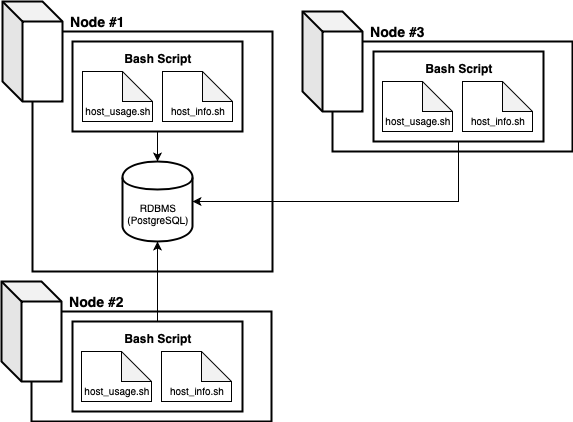

## Introduction

Cluster Monitor Agent is an internal tool that monitors the server cluster resources. It records the hardware specifications of each node (server) and monitors resource usage such as CPU and memory utilization in real time.

The collected data is stored in a locally hosted PostgreSQL database on a designated primary server node. This tool allows for report generation, which can inform future resource planning such as adding or removing servers based on their usage and activity. 

## Architecture and Design


The servers will be set up using the architecture above.

The primary server (no. 1) will host the central database, in which server information and data are stored in two tables: `host_info` and `host_usage`. 

`psql_docker.sh` is a bash script that can be used to start or stop the Docker and PostgreSQL software required for the other scripts.

`ddl.sql` sets up the PostgreSQL database.

The bash agent runs two scripts: `host_info.sh` and `host_usage.sh`.

`host_info.sh` is a script that is run only once after the first initalization. It gathers the hardware specifications of the server, which is then sent to the central database and recorded in the table `host_info`.

`host_usage.sh` is a script that is scheduled to run once a minute. It records the server's resource usage, specifically its CPU and memory utilization. This script also pushes this information to the database table `host_usage` for recording.

## Usage 
1. `psql_docker.sh`: there are two (2) input options for this script.
	* to start: `./psql_docker.sh start [user password]`
	* to stop: `_psql_docker.sh stop`
2. `ddl.sql`: to set up the database, use the below command.
	* `psql -h [hostname] -U [username] -p [port number] -c "ddl.sql"`
3. `host_info.sh`: used to collect server hardware information and to store it in the databaseand executed using the following command.
	* `./host_info.sh [host name] [database name] [username] [user password]`
4. `host_usage.sh`: used to collect server data regarding its memory and CPU usage and executed using the following command.
	* `./host_usage.sh [hostname] [database name] [username] [user password]`

5. `crontab`: In order to schedule `host_usage.sh` to execute once every minute, utilize crontab. In terminal, use the command `crontab -e` to edit scheduled tasks. Add the following code to schedule `host_usage.sh` to execute once a minute once installed on the server:
   ```
   * * * * * * bash [server's local pathway]/host_usage.sh localhost 5432 host_agent postgres password > /tmp/host_usage.log
   ```

6. `queries.sql`: sample queries to demonstrate reports that are possible using the data that is currently collected through the Cluster Monitoring Agent, and executed using:
	* `psql -h [hostname] -U [username] -p [port number] -c "queries.sql"`

## Improvements

1. Expand the number of fields that `host_usage.sh` collects data from. This increases the usefulness of the Cluster Monitoring Agent application, allowing for further insight for the Linux team to manage its resources.
2. Add a script that automatically schedules `host_usage.sh` execution every minute instead of an admin manually scheduling the task through `crontab`.
3. Script functionality to remove server data (hardware and usage) of past/removed servers to clean up existing tables. 
