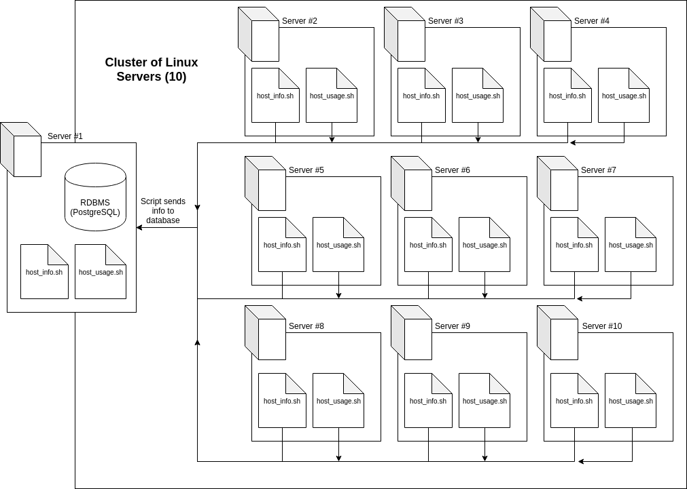

## Introduction

Cluster Monitor Agent is an internal tool that monitors the cluster resources. Irecords the hardware specifications of each node (server), and monitors its resource usage (e.g. CPU/memory) in realtime. The collected data is stored in a database found in a designated primary server node (Server no. 1). This tool allows for the Linux Cluster Administration (LCA) team to use the data to generate reports for future resource planning, such as adding or removing servers based on their usage and activity.

## Architecture and Design

Every server running the Cluster Monitor Agent runs three scripts. 

`psql_docker.sh`is a bash script that can be used to start or stop the Docker and PostgreSQL software required for the other scripts.

`host_info.sh` is a script that is run only once after the first initalization. It gathers the hardware specifications of the server that it is on, which is then sent to the database for the record.

`host_usage.sh` is a script that runs once a minute. It records the server's resource usage, specifically its CPU and memory utilization. This script also pushes this information to the database for record.

## Usage 

To be continued.

## Improvements

To be added at the conclusion.
